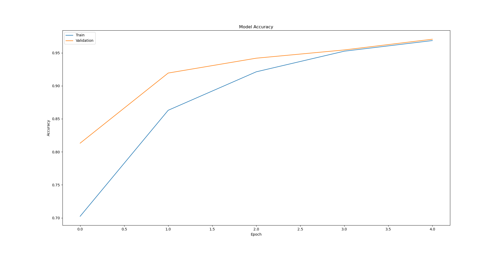
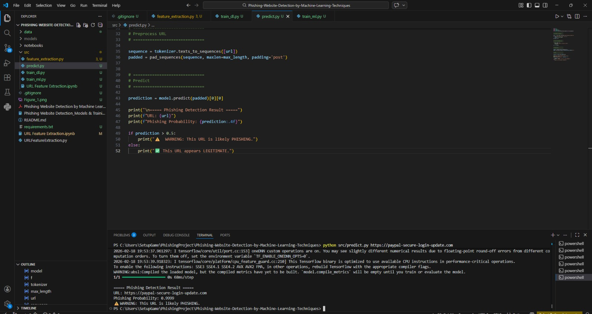
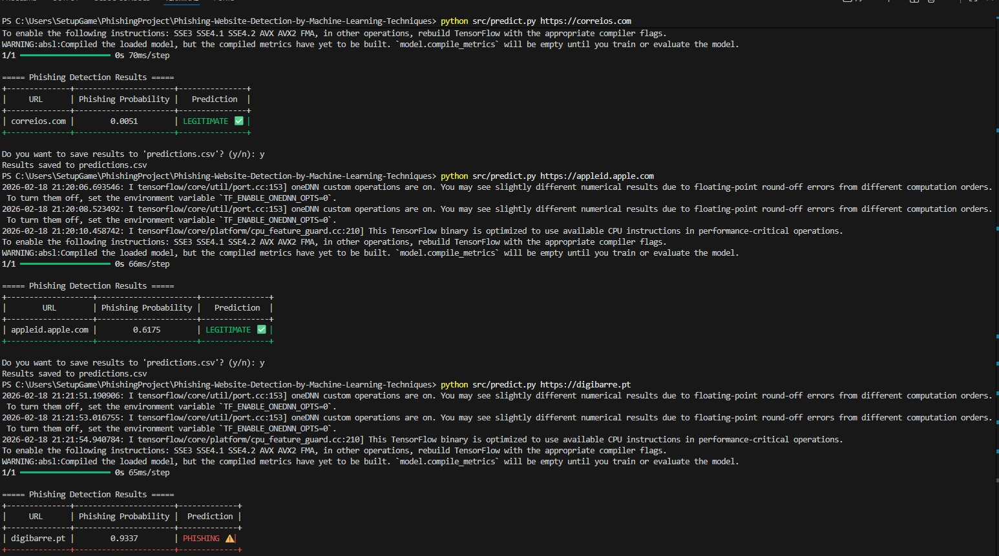

# 🔐 Phishing URL Detection using Machine Learning & Deep Learning

## 📌 Project Overview

Phishing websites are a common form of cyberattack where malicious actors mimic legitimate websites to steal sensitive information.

This project builds an **AI-based phishing detection system** using both:

* 🧠 **Machine Learning (ML)**
* 🤖 **Deep Learning (DL)**

It also includes a **Streamlit web application** that allows real-time phishing URL detection.

The system analyzes URLs using extracted features and predicts whether a website is:

* ✅ Legitimate (0)
* 🚨 Phishing (1)

---

# 🎯 Objectives

* Extract meaningful URL-based and content-based features.
* Train and compare multiple ML models.
* Train Deep Learning models (Neural Networks).
* Evaluate performance using accuracy and other metrics.
* Deploy a real-time phishing detection web app.

---

# 📂 Dataset & Data Collection

## 🔹 Phishing URLs

Phishing URLs were collected from:

👉 [https://www.phishtank.com/developer_info.php](https://www.phishtank.com/developer_info.php)

* 5000 phishing URLs selected randomly.
* Updated hourly from open-source service PhishTank.

## 🔹 Legitimate URLs

Legitimate URLs were obtained from:

👉 [https://www.unb.ca/cic/datasets/url-2016.html](https://www.unb.ca/cic/datasets/url-2016.html)

* 5000 benign URLs selected randomly.
* From the University of New Brunswick dataset.

All datasets are stored inside:

```
DataFiles/
```

---

# 🛠 Feature Extraction

A total of **17 features** are extracted from each URL.

### 🔹 Address Bar Based Features (9 features)

Examples:

* URL length
* Presence of IP address
* Use of “@” symbol
* Number of subdomains

### 🔹 Domain Based Features (4 features)

Examples:

* Domain age
* DNS record
* Web traffic

### 🔹 HTML & JavaScript Based Features (4 features)

Examples:

* IFrame usage
* Redirects
* JavaScript tricks

Feature extraction is implemented in:

```
URL Feature Extraction.ipynb
```

Final processed dataset:

```
DataFiles/5.urldata.csv
```

---

# 🤖 Machine Learning Models

The dataset is split into:

* 80% Training (8000 samples)
* 20% Testing (2000 samples)

This is a **supervised classification problem**.

## ML Models Implemented:

* Decision Tree
* Random Forest
* Support Vector Machine (SVM)
* Multilayer Perceptron (MLP)
* XGBoost
* Autoencoder Neural Network

📌 **Best performing ML model:**
XGBoost Classifier — **86.4% Accuracy**

Saved model file:

```
XGBoostClassifier.pickle.dat
```

---

# 🧠 Deep Learning Model

In addition to ML, a **Deep Learning Neural Network** was implemented using TensorFlow/Keras.

* Fully connected neural network (Dense layers)
* ReLU activation
* Sigmoid output
* Binary cross-entropy loss
* Adam optimizer

The DL model is used for:

* URL classification
* Probability-based phishing detection
* Comparison with ML models

---

# 📊 Model Performance

## Deep Learning Model



* Shows training vs validation accuracy.
* Helps visualize learning performance.

## Machine Learning Model (XGBoost)

* High precision and recall.
* Lightweight and efficient.
* Suitable for production deployment.

---

# 💻 Web Application (Streamlit)

A real-time phishing detection system was built using **Streamlit**.

## Run the App:

```bash
streamlit run app.py
```

## Features:

* Enter a URL manually
* Upload multiple URLs
* Real-time phishing probability
* Clear visual feedback (safe / phishing)

### Web App Interface



---

# 🖥 Command Line Prediction

You can also test URLs via terminal:

```bash
python src/predict.py https://example.com
```

### Example Output



---

# 📁 Project Structure

```
Phishing-Website-Detection/
│
├── DataFiles/                 # Original datasets
├── models/                    # Saved ML & DL models
├── screenshot/                # README screenshots
├── src/                       # Feature extraction & prediction scripts
├── app.py                     # Streamlit web application
├── requirements.txt           # Dependencies
├── XGBoostClassifier.pickle.dat
└── README.md
```

---

# ⚙️ Installation

## 1️⃣ Clone Repository

```bash
git clone https://github.com/yourusername/Phishing-Website-Detection.git
cd Phishing-Website-Detection
```

## 2️⃣ Create Virtual Environment (Recommended)

conda create -n phishing-env python=3.13
conda activate phishing-env


## 3️⃣ Install Dependencies


pip install -r requirements.txt


## 4️⃣ Run Web App


streamlit run app.py


---

# 📈 Future Improvements

* Create a browser extension.
* Improve DL architecture (CNN / LSTM for URL sequences).
* Deploy as a cloud API.
* Integrate real-time phishing database updates.
* Add explainable AI (SHAP values).

---

# 🔐 Why This Project Matters

Phishing attacks are increasing every year.
This project demonstrates how **AI and Machine Learning can be applied in cybersecurity** to detect malicious websites automatically.

It combines:

* Feature engineering
* Supervised machine learning
* Deep learning
* Real-time deployment
* Practical security application

---

# 👨‍💻 Author

Developed as a Machine Learning & Cybersecurity project.
Focused on applying AI to real-world phishing detection problems.

